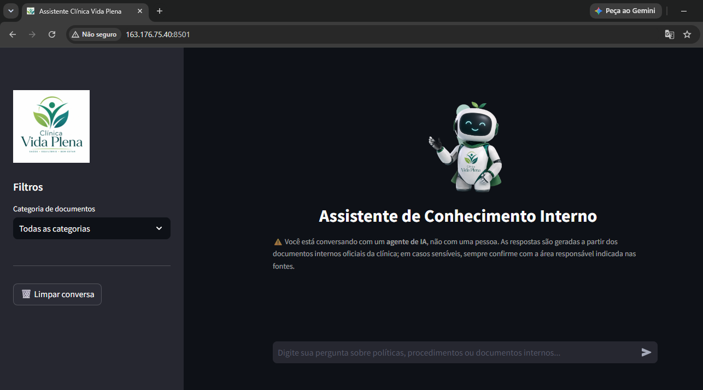
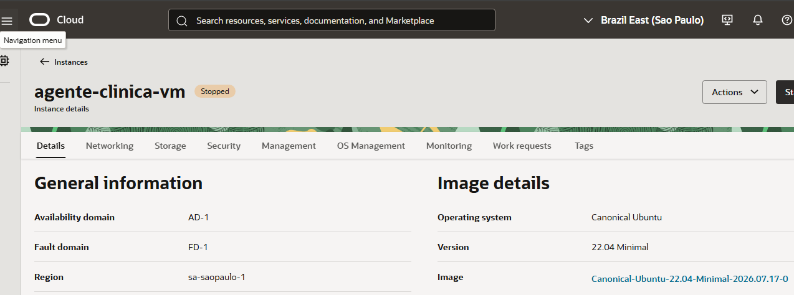
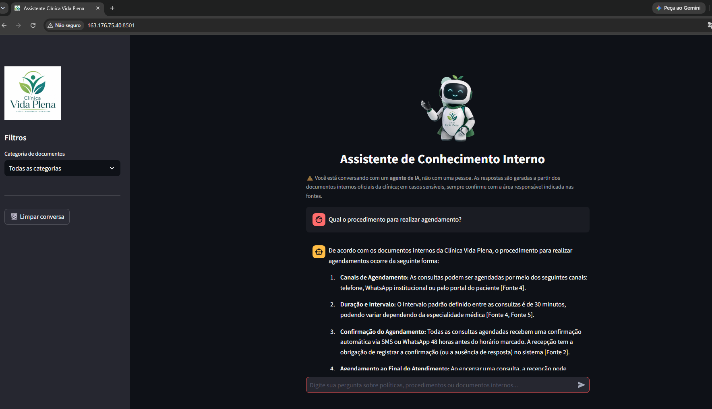
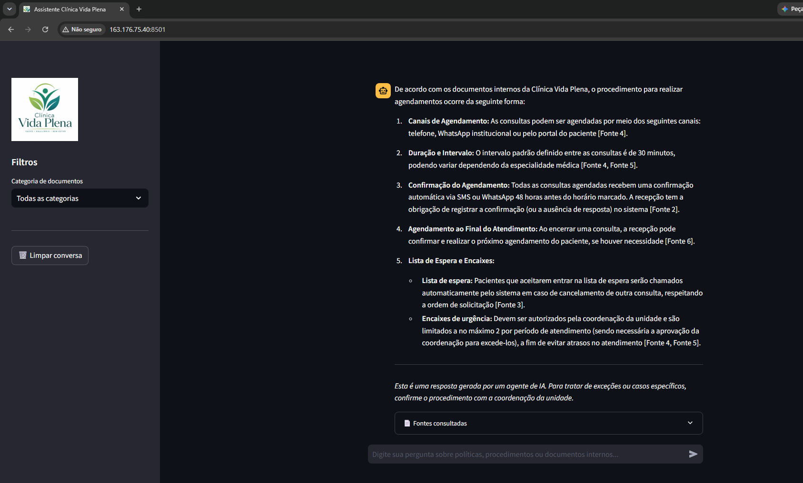

# Agente de Conhecimento Interno — Clínica Vida Plena

Agente de IA corporativo (RAG) que responde perguntas de colaboradores com base em documentos
internos oficiais de uma clínica de saúde fictícia — a **Clínica Vida Plena**. Projeto
desenvolvido para o desafio **Alura Agentes**.

O agente cobre múltiplos formatos de documento (PDF, Word, Excel, PowerPoint, Markdown, CSV,
JSON, HTML) e múltiplas áreas da empresa (RH, Financeiro, Operacional, Legal/Compliance,
Qualidade/Biossegurança, Comunicação Interna e Estratégico), funcionando como base de
conhecimento conversacional, centralizada e sempre disponível para qualquer colaborador.

## Sumário

- [Arquitetura](#arquitetura)
- [Stack técnica](#stack-técnica)
- [Estrutura do projeto](#estrutura-do-projeto)
- [Como rodar localmente](#como-rodar-localmente)
- [Testes](#testes)
- [Deploy na OCI](#deploy-na-oci)
- [Evidência de execução em nuvem](#evidência-de-execução-em-nuvem)
- [Registro de execução](#registro-de-execução)
- [Limitações conhecidas](#limitações-conhecidas)

## Arquitetura

```
data/raw/*.{pdf,docx,xlsx,pptx,md,csv,json,html}
        │  loaders por formato (src/ingestion/)
        ▼
   limpeza + chunking (src/processing/)  ──► chunk + metadados
        │                                     (categoria, arquivo, data,
        ▼                                      autor, localização)
   embeddings Gemini (src/indexing/) ──► ChromaDB persistente (data/chroma_db/)
                                                │
   pergunta do colaborador                     ▼
        │                              busca semântica + filtro de
        ▼                              categoria + threshold de confiança
   src/retrieval/retriever.py  ◄────────────────┘
        │
        ▼ (sem contexto suficiente?)
   ┌─────────────┴─────────────┐
   │                           │
 fallback determinístico   chain LCEL (prompt + Gemini)
 (contato do departamento) com citação [Fonte N]
   │                           │
   └─────────────┬─────────────┘
                 ▼
         log JSONL (logs/execucoes.jsonl)
                 ▼
        interface Streamlit (app.py)
```

Cada etapa está isolada em seu próprio módulo em `src/`, permitindo testar e depurar cada
estágio do pipeline separadamente (ver `tests/`).

## Stack técnica

| Camada | Tecnologia |
|---|---|
| Orquestração RAG | Python + LangChain (LCEL) |
| LLM de geração | Google Gemini (`gemini-3.6-flash`) |
| Embeddings | Google Gemini (`gemini-embedding-001`) |
| Banco vetorial | ChromaDB (persistente, local) |
| Interface | Streamlit |
| Logging | JSONL append-only |
| Deploy | OCI Object Storage + OCI Compute (Always Free) |

O LLM e os embeddings usam a **API do Google Gemini** por ter camada gratuita suficiente para
este projeto — a API da OpenAI foi avaliada primeiro, mas exige créditos pré-pagos. Gere uma
chave gratuita em [aistudio.google.com/apikey](https://aistudio.google.com/apikey).

## Estrutura do projeto

```
agente_challenge/
├── app.py                     # interface Streamlit (só orquestra UI)
├── config.py                  # paths, modelos, thresholds
├── data/
│   ├── raw/<categoria>/       # 18 documentos fictícios nos 8 formatos exigidos
│   ├── contacts/               # base de contatos por departamento (fallback)
│   └── chroma_db/              # índice vetorial (gerado, não versionado)
├── src/
│   ├── ingestion/              # 1 loader por formato + metadados
│   ├── processing/             # limpeza + chunking
│   ├── indexing/               # embeddings + ChromaDB
│   ├── retrieval/               # busca semântica + threshold
│   ├── generation/              # prompt anti-alucinação + chain LCEL
│   ├── contacts/                # lookup determinístico de contato por área
│   └── logging_utils/           # log JSONL de execução e feedback
├── scripts/
│   ├── generate_documents.py    # gera os 18 documentos fictícios
│   ├── ingest_and_index.py      # pipeline fim a fim: raw -> Chroma
│   ├── smoke_test_query.py      # testa retrieval + geração via CLI
│   └── upload_to_oci_object_storage.py
├── deploy/oci/                  # guia e scripts de deploy na OCI
├── logs/execucoes.jsonl         # log de execução (gerado, não versionado)
└── tests/                       # pytest (loaders, chunking, retrieval, logging)
```

## Como rodar localmente

### 1. Ambiente Python

> **Nota (Windows):** o Python 3.13 padrão não tem wheels pré-compilados do ChromaDB para
> Windows, e compilar do zero exige o Visual C++ Build Tools. Este projeto usa **Python 3.12**
> via Conda para evitar essa dependência de compilador.

```bash
conda create -n agente_challenge python=3.12
conda activate agente_challenge
pip install -r requirements.txt
```

### 2. Chave da API

```bash
cp .env.example .env
# edite .env e cole sua GOOGLE_API_KEY (gratuita em https://aistudio.google.com/apikey)
```

### 3. Gerar os documentos fictícios (já incluídos no repositório, mas reproduzível)

```bash
python scripts/generate_documents.py
```

### 4. Indexar a base de conhecimento

```bash
python scripts/ingest_and_index.py
```

### 5. Testar via linha de comando (opcional, antes de subir a UI)

```bash
python scripts/smoke_test_query.py
python scripts/smoke_test_query.py "Quantos dias de férias eu tenho?"
```

### 6. Subir a interface

```bash
streamlit run app.py
```

Acesse `http://localhost:8501`. A interface mostra um aviso de que é um agente de IA, permite
filtrar por categoria de documento, exibe as fontes consultadas em cada resposta e tem botões de
feedback (👍/👎).

## Testes

```bash
pytest tests/ -v
```

Os testes de `tests/test_retrieval.py` fazem chamadas reais à API do Gemini e exigem
`GOOGLE_API_KEY` configurada e a base já indexada — são pulados automaticamente sem a chave.

## Deploy na OCI

O desafio exige o uso de ao menos 1 serviço do ecossistema OCI e a execução real em nuvem (com
evidência em foto/vídeo). Este projeto usa dois:

- **OCI Object Storage** — repositório dos documentos originais (`data/raw/`).
- **OCI Compute (Always Free)** — execução completa da aplicação (Streamlit + RAG + Chroma).

Guia passo a passo completo em [`deploy/oci/setup_compute_instance.md`](deploy/oci/setup_compute_instance.md),
incluindo criação de bucket, geração de chave de API, provisionamento da instância, abertura de
porta e execução via `systemd`.

## Evidência de execução em nuvem

Aplicação rodando de fato numa instância OCI Compute (`agente-clinica-vm`, região `sa-saopaulo-1`),
acessível publicamente e respondendo perguntas reais com base nos documentos indexados.

| | |
|---|---|
|  |  |
| Interface acessada pela URL pública (`163.176.75.40:8501`) | Instância `agente-clinica-vm` no Console OCI |
|  |  |
| Pergunta real, respondida com citação de fontes | Resposta completa, com o expander "Fontes consultadas" |

> A instância é mantida **parada** (`Stopped`) fora de uso, para não ficar exposta publicamente
> sem autenticação nem consumir a cota gratuita da API do Gemini à toa. Pode ser religada a
> qualquer momento pelo Console OCI (o IP público é preservado entre parar/religar).

## Registro de execução

Cada pergunta gera uma linha em `logs/execucoes.jsonl` com: pergunta, filtro de categoria,
trechos recuperados (arquivo + localização + score), se havia contexto suficiente, resposta,
tempo de resposta e modelo usado. Feedback do colaborador gera uma linha de evento separada,
vinculada pelo `execution_id`. Formato append-only, pensado para auditoria e para identificar
lacunas na base de documentos (perguntas recorrentes sem boa resposta).

## Limitações conhecidas

- **Sem reranker dedicado**: a recuperação usa apenas similaridade vetorial + threshold, sem uma
  segunda passada de reranqueamento sobre os candidatos.
- **Sem pipeline de atualização automática**: alterações em `data/raw/` exigem rodar
  `scripts/ingest_and_index.py` manualmente (a reingestão é idempotente — não duplica vetores).
- **OCR desligado por padrão**: o loader de PDF tem um hook de fallback via Tesseract
  (`ENABLE_OCR_FALLBACK` em `config.py`), mas nenhum dos documentos fictícios é escaneado, então
  esse caminho não foi exercitado.
- **Threshold de confiança calibrado empiricamente**: `SCORE_THRESHOLD` (`config.py`) foi
  ajustado observando a distribuição de scores do Gemini neste corpus específico; um corpus muito
  maior ou mais diverso pode exigir recalibração.
- **Sem classificação automática de categoria da pergunta**: o filtro por categoria na interface
  é manual (selectbox), não inferido a partir do texto da pergunta.
